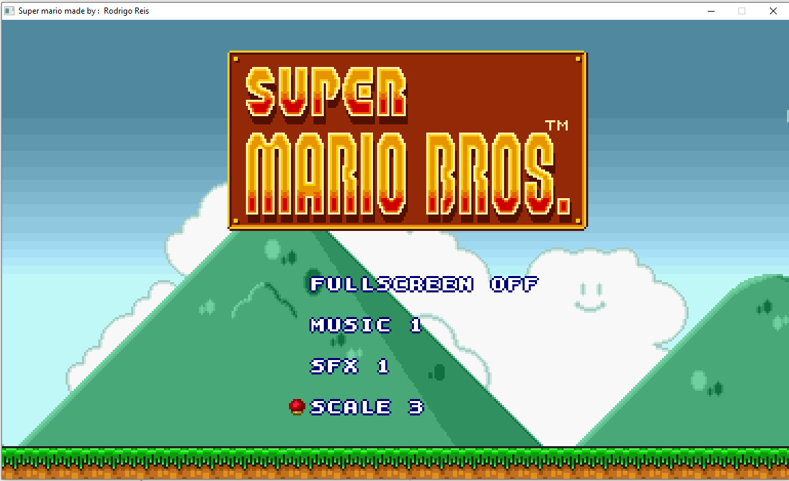
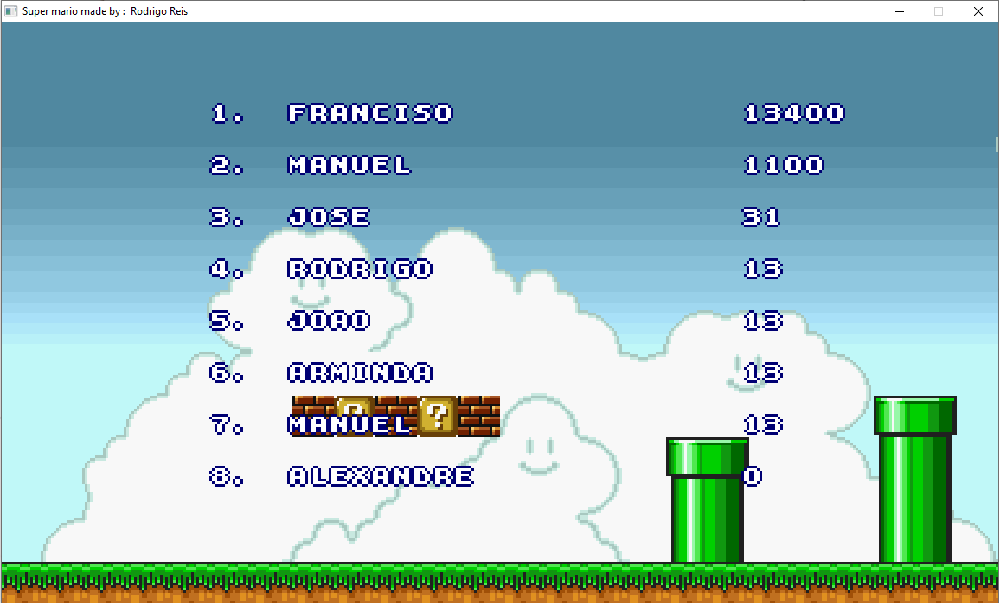
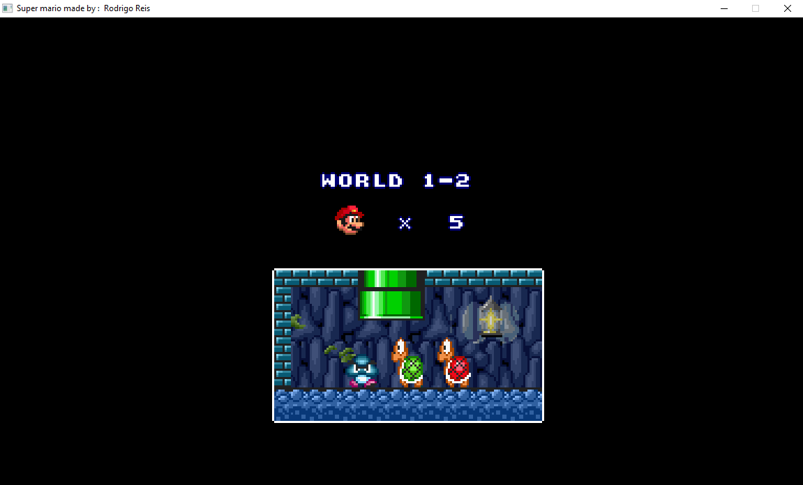
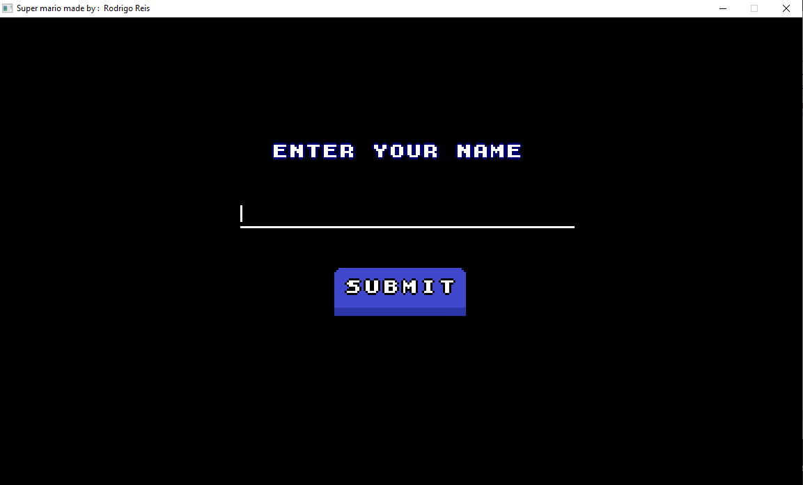
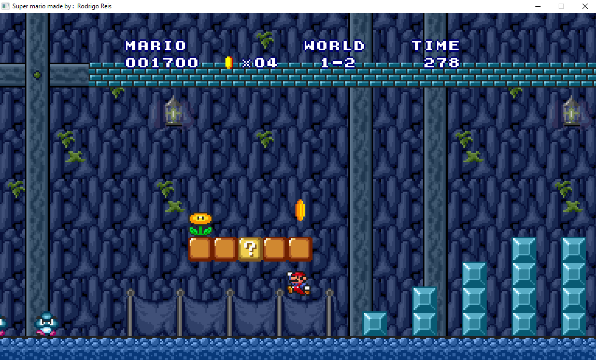

<h1>Super-mario-bros</h1>
<p>
    Jogo do Super Mario bros feito com c++ e a biblioteca SDL2 como projeto de aptidão profissional.
</p>

<h2>Material</h2>
<p>
    Uma boa parte dos sprite foram recolhido do site: “https://www.spriters-resource.com/” onde tem varios sprites,cenarios,fontes de jogos  do estilo 2D.
</p>

<h2>Compilação</h2>
<h3>Clone</h3>

```
 git clone https://github.com/Rreis019/SuperMarioRecreation.git
```

<h3>Windows</h3>
<p>1 - Instalar o pacote <a href="https://sourceforge.net/projects/mingw-w64/files/Toolchains%20targetting%20Win64/Personal%20Builds/mingw-builds/8.1.0/threads-win32/seh/x86_64-8.1.0-release-win32-seh-rt_v6-rev0.7z/download">Mingw64</a> que vem com gcc,g++ colocar no disco C:\
</p>

<p>2 - Configurar a variaveis ambiente do windows e por caminho do mingw no path</p>
<p>
    3 - Instalar a biblioteca
    <a href="https://www.libsdl.org/download-2.0.php">SDL2-devel-2.0.22-mingw,</a>
    <a href="https://www.libsdl.org/projects/SDL_image/">SDL2_image-devel-2.0.5-mingw.tar.gz,</a>
    <a href="https://www.libsdl.org/projects/SDL_mixer/"> SDL2_mixer-devel-2.0.4-mingw.tar.gz,</a>
    <a href="https://www.libsdl.org/projects/SDL_mixer/">SDL2_ttf-devel-2.0.18-mingw,</a>
    e por pasta na mingw
</p>
<p>4 - Mudar o nome do mingw32-makefile para makefile na pasta(C:\mingw64\bin)</p>
<p>
   5 - Depois de instalar o Mingw64,SDL2,SDL_image e o SDL_mixer, abra o terminal na raiz do projeto execute o seguinte comando
</p>

```
 make
```

<h2>Telas do jogo</h2>

| Nome da Tela        | Imagem                                         |
|:--------------------|:-----------------------------------------------|
| `TitleScreen`       |         | 
| `OptionsScreen`     |       | 
| `Scoreboard`        |          | 
| `NewGameScreen`     |       | 
| `NextLevelScreen`   |           |
| `SubmitScoreScreen` |   |
| `GameScreen`        |          |
